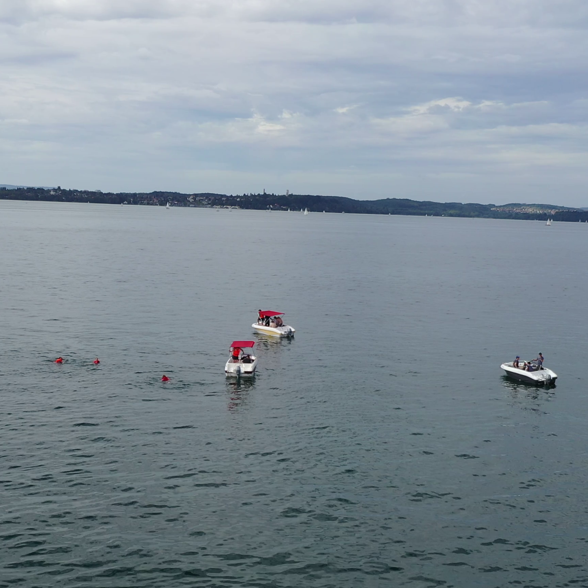
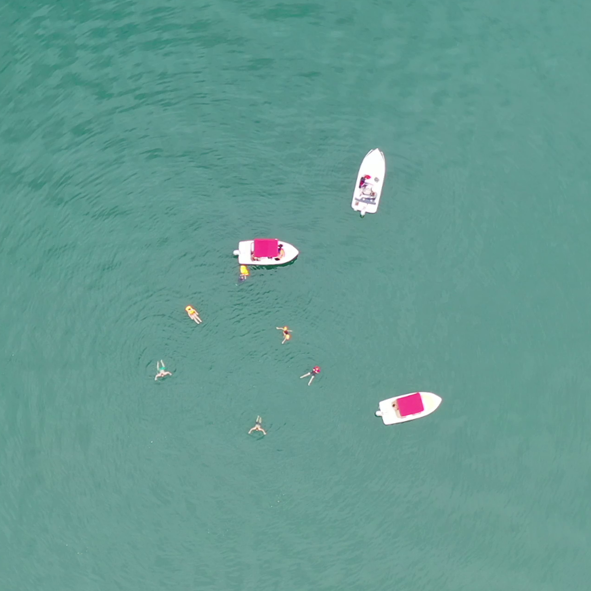
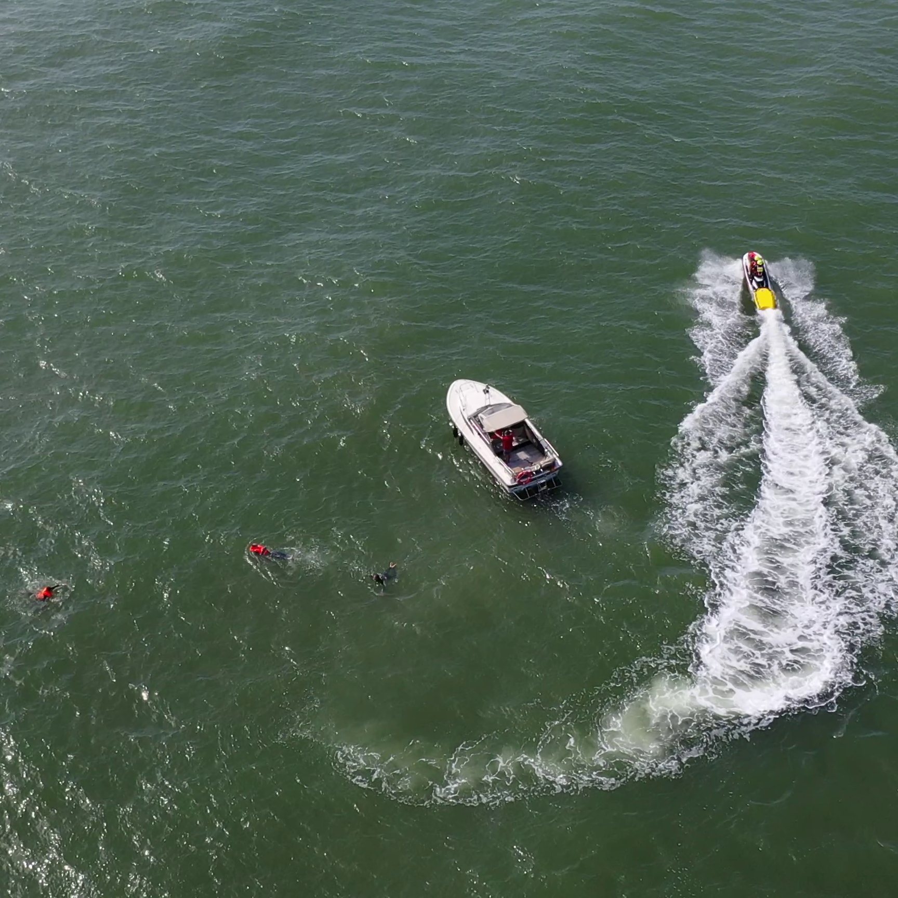

Student: 
Diogo Samuel Fernandes1 

Advisors: 
João Bispo1 
Mónica Figueiredo2,3 
Luís Conde Bento2,4 

1 University of Porto, Porto, Portugal; 
2 Polytechnic of Leiria, Leiria, Portugal; 
3 Instituto de Telecomunicações, Portugal;  
4 Institute of Systems and Robotics, Coimbra, Portugal 

# Exploring Metadata in Neural Networks for UAV Maritime Surveillance
This work introduces an approach to develop a neural network that remains unaffected by image-capturing conditions, specifically variations in altitude and shooting angle in UAV maritime images. To achieve this, we integrate metadata information into the neural network architecture and employ an adversarial learning training methodology, making the network invariant to these image-capturing features. By achieving this, we aim to enhance the accuracy and reliability of object detection in maritime surveillance tasks.

    

        
        
        
    

    
UAV optical images from the SeaDronesSee dataset.

It is important to acknowledge that this deliberate emphasis on making the model invariant to domain characteristics may have potential drawbacks. The model may inadvertently overlook these variables and struggle to accurately detect objects, which is the main task. To mitigate this potential impact, we selectively use the domain classification module (Fd) after a predefined number of training epochs without it. This approach allows us to strike a balance between emphasizing object-related information and minimizing the impact of inherent image-capturing characteristics.

In our approach, the feature extractor aims to align the distributions of encodings across different domains, thereby minimizing the dissimilarity between similar images captured in different conditions. It is worth noting that our architecture is designed to handle multiple domains, making it flexible to accommodate an arbitrary number of Fd components.

This work builds upon the YOLOv7 model, which is a state-of-the-art real-time object detector, to enhance its capabilities and make it robust against image-capturing conditions. By integrating metadata into the network and employing an adversarial learning approach, we aim to maximize object detection performance (performed by Fo) while simultaneously making the domain classification (performed by Fd) incapable of accurately discerning the domain characteristics.

[[Paper (Soon)]()] [[Thesis](https://repositorio-aberto.up.pt/handle/10216/151939)]

## Setup
We used python 3.10.6 and pytorch 2.0.0 during our work. To effortlessly set up the necessary dataset and configure the data for running this project, simply execute the following command:

> make all

This command will download the required dataset and perform the essential data setup steps, ensuring that everything is prepared and ready to be utilized for running the project smoothly. After completing the dataset setup, activate the virtual environment by running the following command:

> source venv/bin/activate

By following these installation steps, you'll have the dataset prepared and the project environment ready to run the experiments effectively.

## Results and Experiments
Our project's comprehensive data analysis is documented in the Jupyter Notebook file named `docs/data_analysis.ipynb`. The analysis covers various aspects of our research and includes detailed findings, insights, and visualizations.

To replicate and reproduce our experiments, we have provided scripts in the `script/` folder. Running these scripts will allow you to recreate the experiments and validate our findings independently. All the results obtained from our experiments can be accessed in the `docs/results.xlsx` directory. These results provide a comprehensive overview of the performance metrics, model evaluations, and any other relevant outcomes. For additional details and a deeper understanding of the experiments, we have included wandb links in the results sheet. These links provide access to more comprehensive experiment logs, visualizations, and other relevant information.

By exploring the `docs/data_analysis.ipynb` file, examining the results in the `docs/results.xlsx` directory, running the provided scripts in the `scripts` folder, and utilizing the wandb links in the results sheet, you can thoroughly understand our research methodology, reproduce the experiments, and delve into the finer details of our findings.

